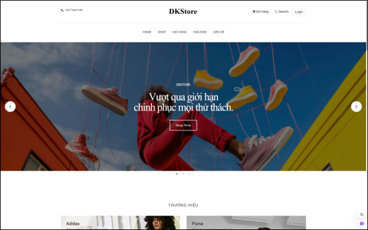
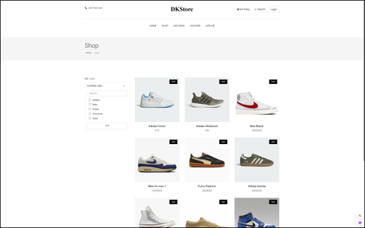
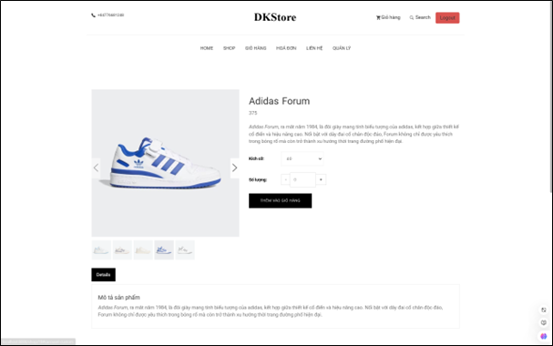
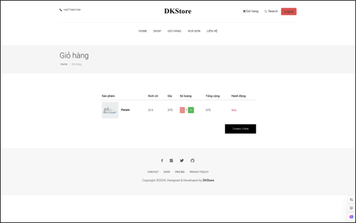
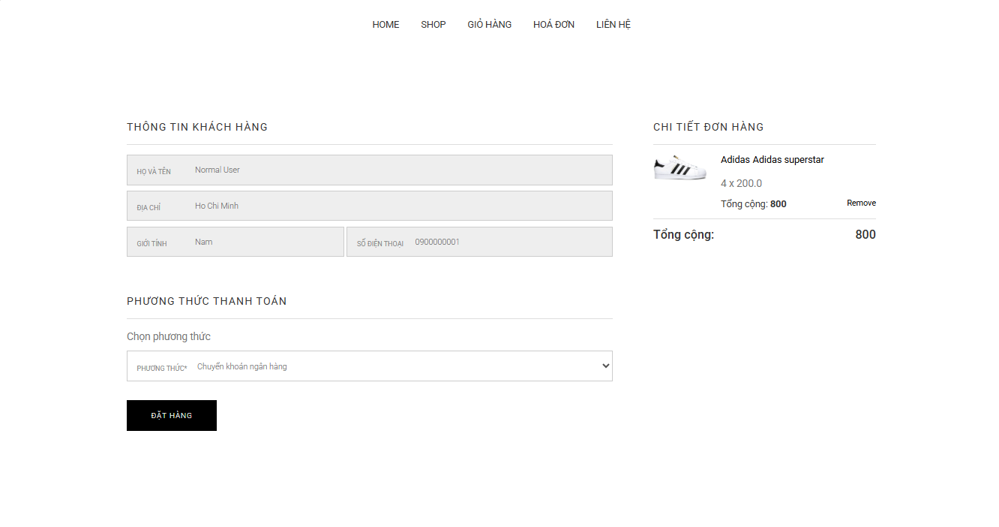
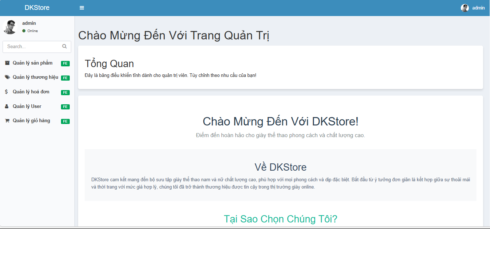

# DKStore

## Mô tả dự án
DKStore là một ứng dụng quản lý cửa hàng trực tuyến (e-commerce) được xây dựng bằng Spring Boot với giao diện front-end và back-end một stack. Ứng dụng hỗ trợ quản lý sản phẩm, giỏ hàng, thanh toán, hóa đơn, và phân quyền người dùng (user/admin).

## Demo triển khai
- URL dự án đã deploy: `https://dkstore.ltk.id.vn/`

### Ảnh demo







## Tài khoản mặc định (seed sẵn 2 role)
- User: `user` / `123456`
- Admin: `admin` / `123456`

## Hướng dẫn chạy local
1. Clone repository:
   ```bash
   git clone https://github.com/lekhai0123/DKStore.git
   cd DKStore
   ```
2. Chạy bằng Maven:
   ```bash
   ./mvnw spring-boot:run
   ```
   Hoặc Windows:
   ```powershell
   .\mvnw.cmd spring-boot:run
   ```
3. Truy cập nội dung ứng dụng:
   - Backend + frontend admin: `http://localhost:10000/admin`
   - Frontend người dùng: `http://localhost:10000/`

## Cấu trúc thư mục
- `src/main/java`: mã nguồn Java Spring Boot (controllers, models, services, repository...)  
- `src/main/resources/templates`: các template Thymeleaf (admin/user).  
- `src/main/resources/static`: tài nguyên tĩnh (css/js/images).  
- `demo/`: ảnh và nội dung demo dự án.

## Thông tin thêm
- Tập tin cấu hình: `src/main/resources/application.properties`
- Dự án đã sẵn sàng build ra WAR: `target/DKStore-0.0.1-SNAPSHOT.war`

> Lưu ý: nếu cần mở rộng (cài đặt database khác, cấu hình email, OAuth), bạn có thể chỉnh lại `application.properties` và các class cấu hình trong `com.dkstore.config`. 
